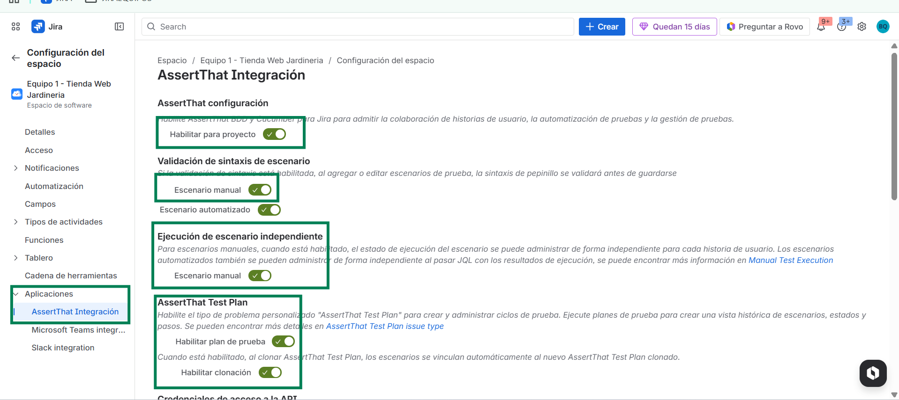
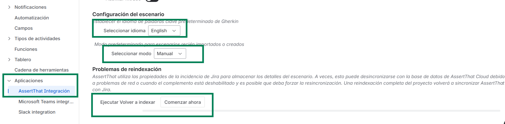
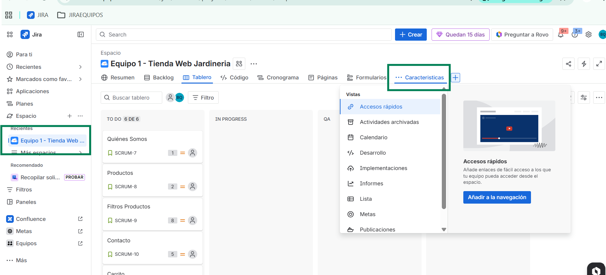
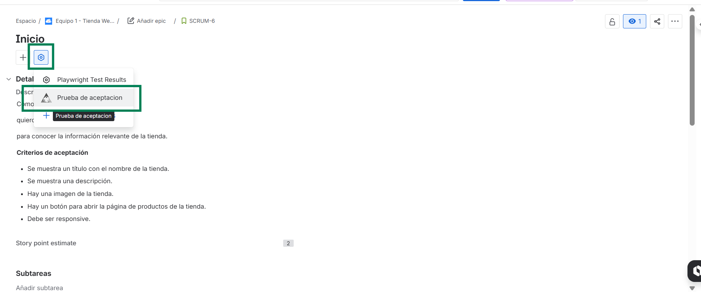
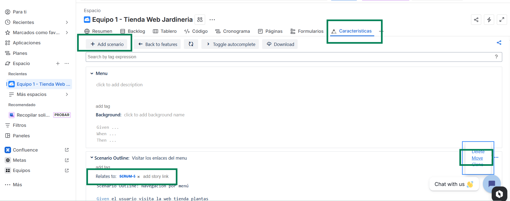
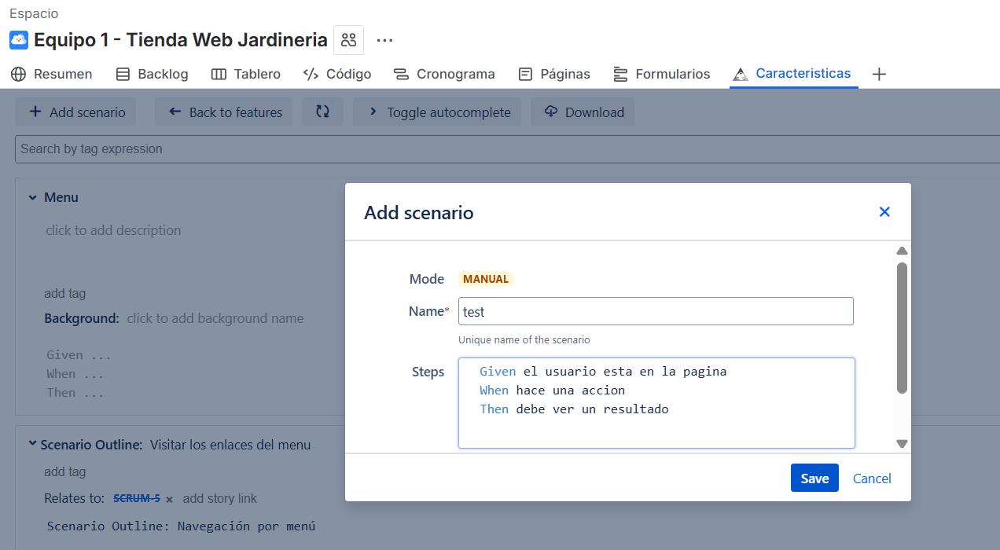
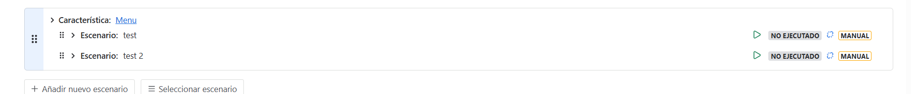
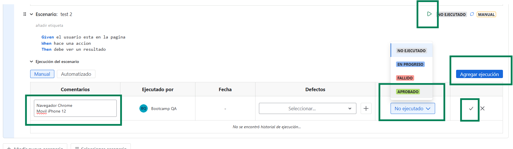
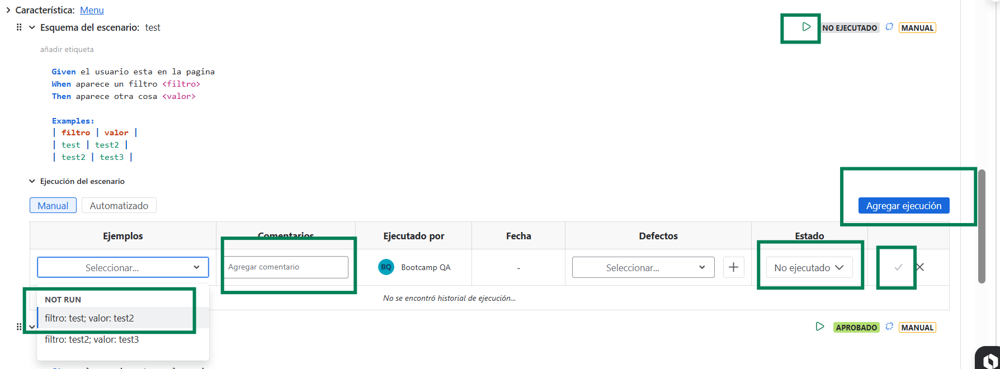

## Herramienta de Administración de pruebas AssertThat

### 1. Activar Herramienta AsserThat en el Proyecto
Una vez el administrador ha instalado la herramienta de gestión de pruebas, puedes activarla en tu proyecto siguiendo estos pasos:
2. Ve a aplicaciones, y debe aparecer Asserthat integration.
3. Activa lo siguiente:
- Activa todos (todos en verde)
- Idioma: IMPORTANTE INGLÉS. No funciona bien en otro idioma la validación, para quienes lo hacéis en ingles no hay problema, para quienes lo hagáis en español, podéis poner todo en español menos las palabras GIVEN, WHEN, THEN, AND, EXAMPLES que son las que da el estándar y para validar bien teneis que usar las mismas exactamente.
4. Haz clic en el boton del final reindexar para aplicar los cambios.
  
   
5. Vuelve al tablero de la aplicación, la aplicación Asserthat (Características si está en Español) aparecerá en la barra superior
 
  6. Abre cualquier historia de usuario, aparecerá como opción dentro de las historias de usuario.
 

### 2. Agregar pruebas/escenarios en Asserthat
Asserthat deberia permitir crear varios escenarios para la misma feature/característica desde la historia de usuario pero por un error en la aplicación no te permite hacerlo desde historia de usuario, asi que debes crear las pruebas en su lugar desde la pestaña asserthat:

1. Abre la pestaña Asserthat
2. Haz clic en la pestaña feature/caracteristicas
3. Abre la feature-caracteristica a la que quieras agregar un escenario pinchando en ella, o crea una nueva.

 

6. Agrega los escenarios haciendo clic en crear escenario

7. Agrega titulo y pasos
 
8. Una vez creados los escenarios, asocialos a la historia de usuario, para ello rellena el campo related-to de cada escenario con el id de la historia de usuario a la que lo quieras asociar.
   
10. Por ultimo abre la historia de usuario y veras los escenarios creados.

   

### 3. Mover pruebas/escenarios en Asserthat
Si has creado algun escenario en un feature/caracteristica diferente y quieres moverlo sin tener que borrarlo, puedes seguir los siguientes pasos:
1. Abre la pestaña Asserthat
 
2. Haz clic en la pestaña feature/caracteristicas
   
4. Entra en la feature en la que tengas el escenario, haciendo clic en ella
5. Haz clic en los 3 puntitos del escenario y elige la opcion move
   
7. Selecciona el nuevo feature al que quieres moverlo

### 4. Eliminar Features/caracteristicas en Asserthat
Si has creado por error algun feature/caracteristicas en asserthat, puedes borrarlo siguiendo los siguientes pasos.
1. Abre la pestaña Asserthat
    
2. Haz clic en la pestaña feature/caracteristicas
      
3. Haz clic en los 3 puntitos de la caracteristica/feature que quieras eliminar
4. Selecciona la opcion borrar y se eliminará la feature

### 5. Agregar Resultados de Pruebas en Asserthat
Una vez creadas las pruebas, puedes agregar los resultados de prueba desde la historia de usuario de JIRA. Sigue los siguientes pasos.
A - Si es un escenario/prueba normal (sin examples):
1. Haz clic en ejecutar
2. Elige agregar ejecución
3. Selecciona el resultado de la prueba (passed/failed) y comentario (recomendado agregar navegadores en los que se ha probado)
4. Guardar

   

B - Si es un escenario outline (con examples):
1. Haz clic en ejecutar
2. Elige agregar ejecución
3. Elige el example (debes poner un resultado para cada example)
4. Selecciona el resultado de la prueba y comentario
5. Guardar
6. Agrega otra ejecución para el siguiente example y repite los pasos hasta poner los resultados de todos los examples.

   
