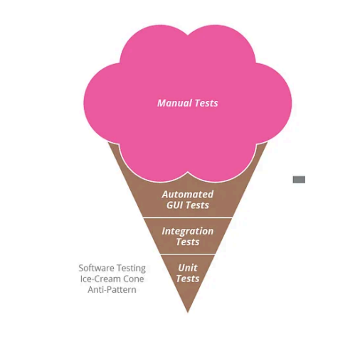
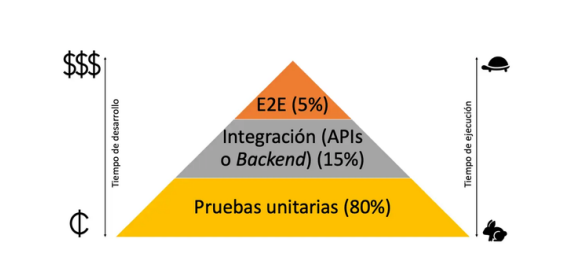
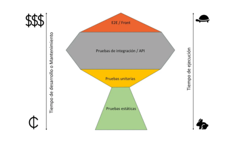

# Estrategia de Automatización de Pruebas

## 1. La importancia de la automatización de pruebas

La automatización de pruebas aporta numerosos benificios:

- Acelera la fase de la ejecución de pruebas
- Detecta errores en fases tempranas
- Aumenta la cobertura de pruebas
- Se pueden ejecutar pruebas de forma más frecuente
- Una vez implementadas, son más fiables que las manuales.

Sin embargo para llevarlo a cabo también requiere una inversión inicial en:

- Costes adicionales en herramientas de pruebas automatizadas
- Aprendizaje por parte del equipo para automatizar pruebas
- Las pruebas requiren un mantenimiento cuando hay cambios.
- Inversión de tiempo inicial en automatización

> Muchos equipos no quieren hacer la inversión inicial de automatizar pruebas, porque “no tienen tiempo”, aunque a medio plazo, es algo que les ahorrará mucho.

---

## 2. El antipatrón del Cono de Helado

Muchos equipos se centran en automatizar pruebas a nivel de usuario, es decir, a través de la interfaz gráfica GUI.

Esto tiene como objetivo, encontrar errores, cuando el énfasis deberia estar en prevenirlos.

Las pruebas a nivel de interfaz gráfica son más costosas:

- Tardan más tiempo en ejecutarse
- Necesitan más recursos
- Si se automatizan, necesitan más tiempo de mantenimiento ya que cualquier cambio les afecta

> A la larga, puede convertirse en algo complejo de mantener

---

## 3. Tipos de Pruebas Automatizadas
### Pruebas unitarias

Se ejecutan en la fase de desarrollo, y las debe hacer el desarrollador.

Estas pruebas son rápidas, económicas y fáciles de implementar. Permiten obtener feedback inmediato, esto permite arreglar errores en minutos, mientras que los detectados en fases más avanzadas como los encontrados en entornos de prueba puede tardar varios días en identificarse y arreglarse.

El problema de las pruebas unitarias es que son muy dependientes del código, por lo que requiere que se actualicen cada vez que se hace un cambio. También que prueban a nivel unitario, lo que no cubre la integración con otros componentes que son importantes.

### Pruebas Integración/API/Componente

Se ejecutan pruebas de integración para asegurar de que todos los componentes juntos funcionen correctamente. Aquí es donde podemos probar la mayoría de la lógica sin pasar por la interfaz de usuario.

Estas pruebas requieren más tiempo de implementación y más recursos que las unitarias, pero mucho menos que las de GUI (Interfaz de usuario).

- Son un punto intermedio entre las unitarias y las de GUI.
- Tienen una mayor cobertura que las unitarias.
- Dependen menos del código por lo que son menos frágiles.
- Son más rápidas de ejecutar.

### Pruebas de GUI: Interfaz gráfica

Son las más costosas, ya que requieren de más recursos para ejecutarse, necesitan tener la aplicación completa desplegada, con su base de datos y todas sus dependencias. Al depender de la parte gráfica, son más frágiles, ya que es más probable que cambie la parte visual que la lógica (API), por lo que necesitará mayor tiempo de mantenimiento, para actualizar las pruebas cada vez que cambie la parte visual.

- Su ejecución es más lenta y requiere más tiempo y recursos que las pruebas de API.
- Suelen ser más frágiles, y es fácil que den falsos positivos/negativos si no tienen un buen diseño.
- Es recomendable automatizar sólo las pruebas más críticas, con un enfoque end to end.

---

## 4. Patrones de automatización de pruebas

### Pirámide de pruebas de Mike Cohn

La mayor parte de las pruebas automatizadas deben ser las unitarias, ya que tienen menor coste de implementación y ejecución. A continuación debe cubrirse las pruebas de integración o APIs que aseguren que los componentes funcionen bien entre sí.

Por último las E2E, deben ser las menos numerosas, ya que tienen un coste mayor de mantenimiento y ejecución.

### Trofeo de Pruebas de Kent C

Le da menor importancia a las pruebas unitarias, y agrega en su lugar, pruebas estáticas (sonarqube) que contribuyen a mejorar la calidad del código, y no necesitan implementación. A continuación le da más importancia a las pruebas de API e Integración, ya que son solo un poco más costosas que las unitarias, y tienen mucha mayor cobertura.

Sigue dándole un menor volumen a las pruebas E2E por su alto coste y menor rapidez.
